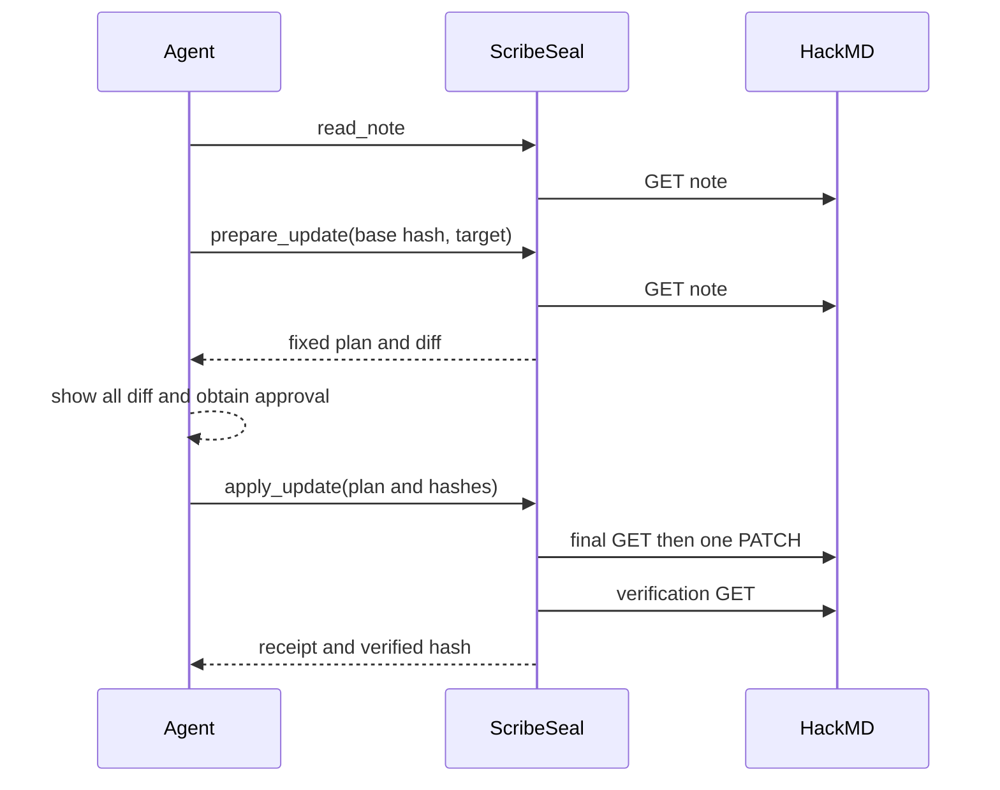
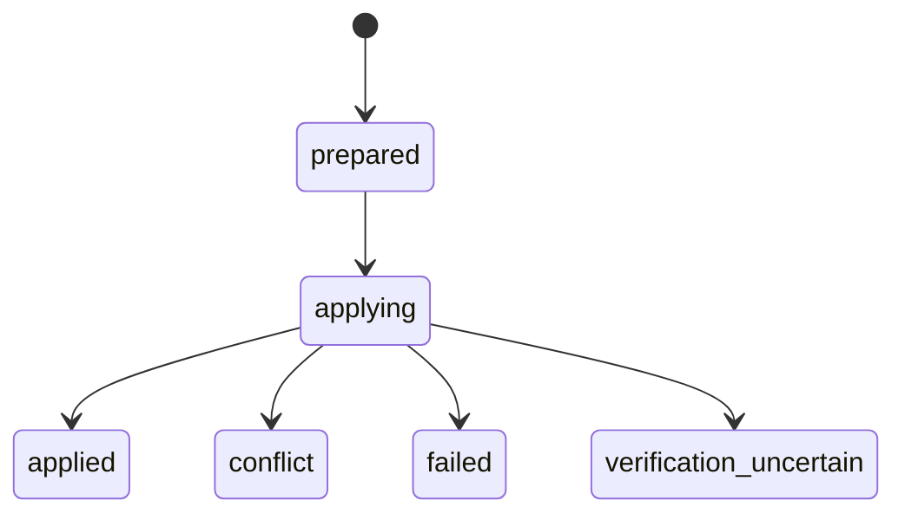

# Architecture

## Scope

ScribeSeal exposes exactly four MCP tools for existing allowlisted HackMD notes: read, prepare, read diff, and apply. It does not list, search, create, delete, retitle, retag, change permissions, manage teams, edit sections, synchronize in the background, or abstract multiple document providers.

The only abstract boundaries are `HackMdGateway` and `StateStore`. Hashing, canonicalization, diffing, risk calculation, UUID generation, and time remain concrete functions, with time/UUID injection only where tests need determinism.

## State

Terminal plans never transition back to prepared or applying. Reapplying an applied/conflict/uncertain plan returns the existing receipt and performs no PATCH. A crash while applying or an unresolved local guard fails closed for manual investigation.

Each plan directory contains `base.md`, `target.md`, `diff.patch`, `plan.json`, an apply guard during application, and `receipt.json` after a terminal observation. All paths are derived from validated UUIDs and fixed filenames.

## Conditional update decision

HackMD's published OpenAPI contract documents GET note and PATCH content, but no ETag response field, `If-Match` parameter, or 412 response. The official client exposes raw GET headers but its typed content-update method does not expose arbitrary request headers. Without the deferred live spike, version 0.1.0 therefore uses `preflight-best-effort`: compare canonical content hash, ETag when observed, and `lastChangedAt` immediately before one PATCH, then verify after writing.

If a dedicated live test later proves functional `If-Match`, a small PATCH-only adapter may use standard `fetch` while reads remain on `@hackmd/api`. The guarantee must change only with a stale-ETag integration test.

## Rejected alternatives

- Calling the official MCP from another MCP adds an MCP-over-MCP dependency, prevents conditional header control, and couples ScribeSeal to another tool shape. ScribeSeal calls the official REST client directly.
- A Skill alone cannot fix plan artifacts, reject stale bases server-side, or enforce post-write verification. The Skill guides ordering; server checks remain authoritative.
- A generic provider interface is deferred until a second real provider exists. HackMD-specific behavior is clearer now.
- A public Remote Plugin requires public hosting, OAuth 2.1 authorization, and a secure broker for HackMD credentials. That authentication system is larger than this local MVP.
- Automatic rollback can overwrite edits made after ScribeSeal's PATCH, so uncertain states stop for human review.
